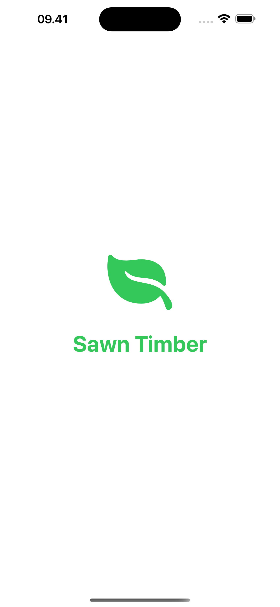
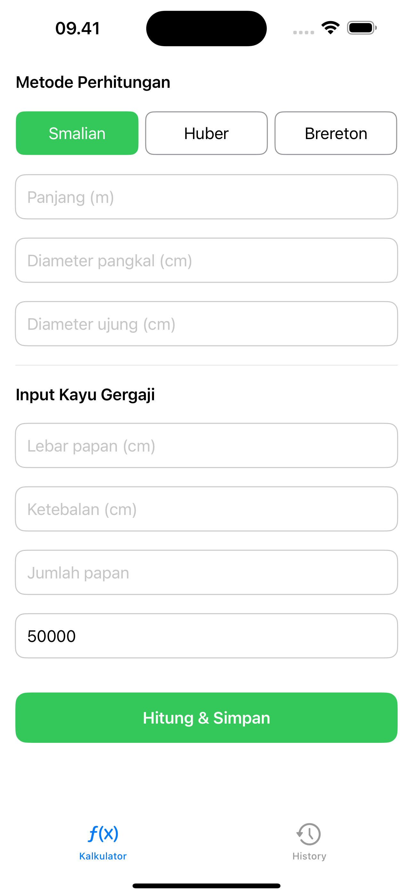
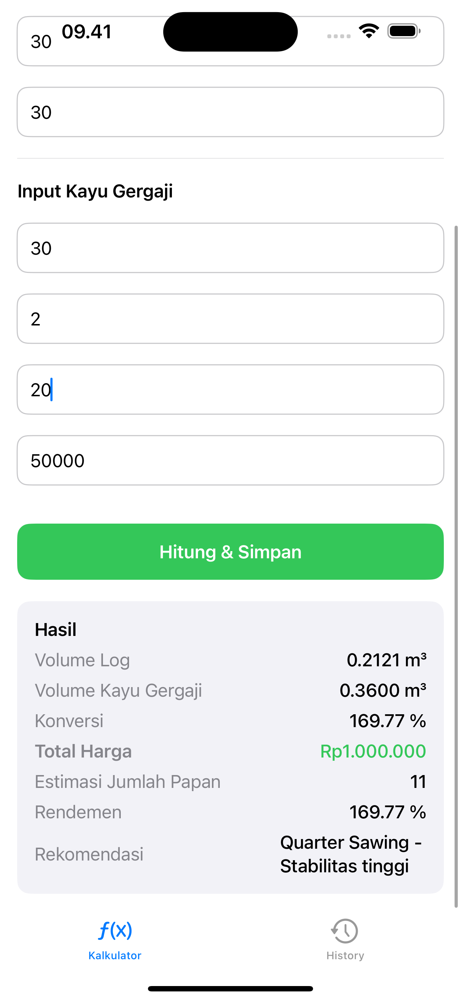
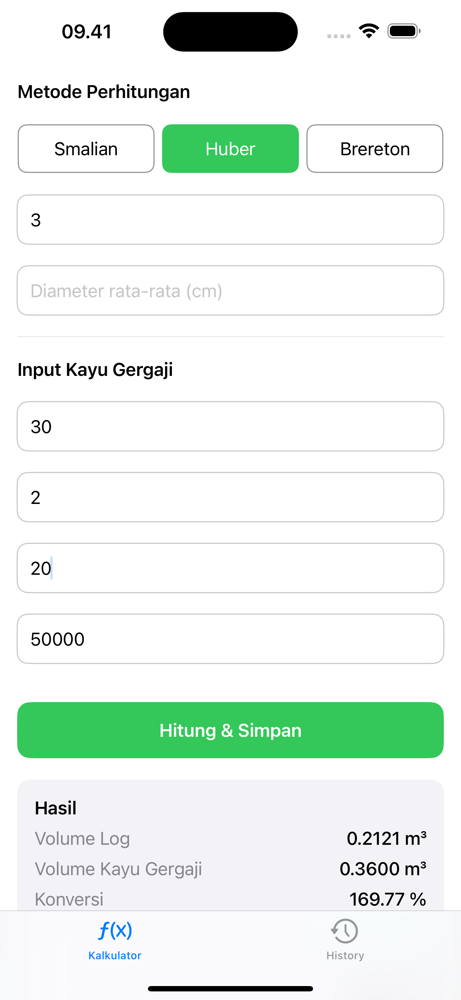
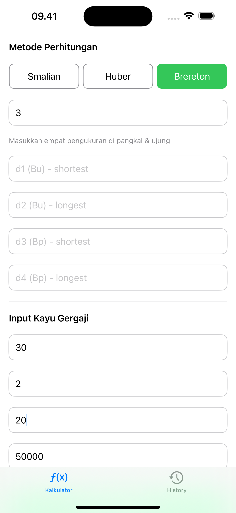
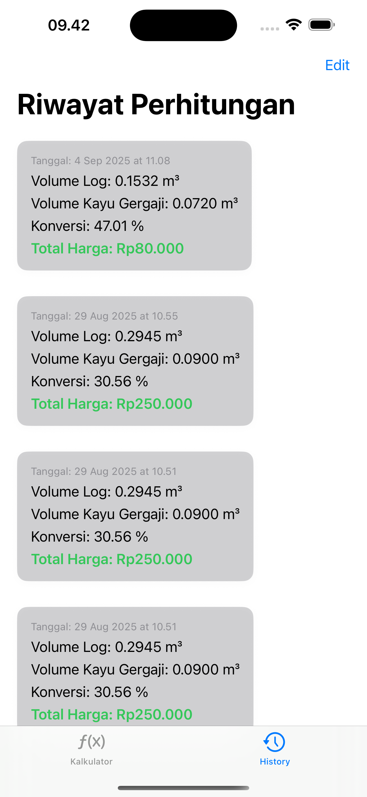

🍎 Sawn Timber Mobile (iOS)

Aplikasi Sawn Timber Mobile (iOS) adalah aplikasi untuk perhitungan, perkiraan harga dari kayu gergajian, menggunakan metode Smallian, Huber dan Bereton,
📸 Display app

 
   
  
   
    
    
    

✨ Fitur Utama

-Menghitung menggunaan beberapa metode Smallian, Huber dan Bereton
-Save Hasil perhitungan 

🚀 Tech Stack

Swift
SwiftUI
Combine
Core Data
MVVM Architecture

🛠️ Cara Menjalankan

Clone repository ini:

git clone https://github.com/arysugiarto/sawn-timber-ios.git
cd sawn-timber-ios

-Buka project di Xcode 14 atau lebih baru
-Pilih target device (iPhone/iPad)
-Klik Run ▶️ untuk menjalankan aplikasi

📄 Lisensi

Proyek ini dilisensikan di bawah MIT License
.
